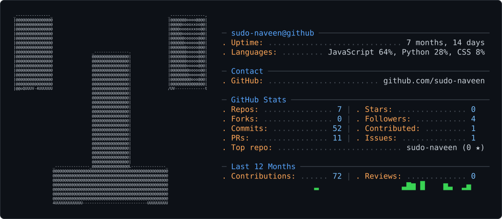

<picture>
  <source media="(prefers-color-scheme: dark)" srcset="dark_mode.svg">
  <source media="(prefers-color-scheme: light)" srcset="light_mode.svg">
  
</picture>

# Hi, I'm Naveen Kumar

Backend Developer | Python | SQL | AI

I'm an engineering student interested in backend development,
AI-powered applications, and building practical software projects.

## Projects

* **Prism** - Data analytics and visualization platform
* **Daton** - AI-powered data analyst
* **Echo** - Interview preparation platform

## Skills

**Languages:** Python • C • C++ • SQL

**Backend:** Django • FastAPI • REST APIs

**Tools:** Git • GitHub • Linux

**Frontend:** React

